# 🎨 AquaIntel - UML Diagram Templates & Visual Guides

## Ready-to-Use Mermaid Diagrams for UML Creation

---

## 1. CLASS DIAGRAM - Main Architecture

```mermaid
classDiagram
    class FastAPIApp {
        +predict()
        +predict_transformer()
        +predict_comprehensive()
        +get_satellite()
        +get_geospatial()
        +compare_locations()
    }
    
    class AdvancedEnsemblePredictor {
        -models: Dict
        -weights: Dict
        -performance_history: List
        +initialize_models()
        +predict(lat, lon): Dict
        +optimize_weights()
        +update_weights_from_feedback()
    }
    
    class SpatialTransformerNetwork {
        -d_model: int = 256
        -num_heads: int = 8
        -num_layers: int = 6
        +multi_head_attention()
        +positional_encoding()
        +forward(): ndarray
        +predict_groundwater(): Dict
    }
    
    class LSTMTemporalModel {
        -hidden_units: int = 128
        -num_layers: int = 3
        +predict_temporal_patterns(): Dict
        +forecast_next_values(): ndarray
        +analyze_seasonality(): Dict
    }
    
    class SatelliteDataProcessor {
        -cache: Dict
        -data_sources: Dict
        +fetch_satellite_data(): Dict
        +_fetch_sentinel2(): Dict
        +_fetch_landsat(): Dict
        +_fetch_modis(): Dict
        +_fuse_satellite_sources(): Dict
    }
    
    class GeospatialAnalyzer {
        -dem_cache: Dict
        -geological_db: Dict
        +analyze_location_3d(): Dict
        +_analyze_terrain(): Dict
        +_analyze_geology(): Dict
        +_analyze_hydrology(): Dict
        +_analyze_soil(): Dict
    }
    
    class RealtimeDataEngine {
        -apis: Dict
        +fetch_all_data(): Dict
        +_fetch_nasa_power(): Dict
        +_fetch_weather_data(): Dict
        +_fetch_elevation(): Dict
        +calculate_groundwater_score(): Dict
    }
    
    class QuantumNeuralNetwork {
        -num_qubits: int
        -registers: List
        +create_quantum_circuit()
        +apply_ansatz()
        +optimize_parameters()
        +predict(): Dict
    }
    
    class PredictionRequest {
        +latitude: float
        +longitude: float
        +analysis_depth: str
        +include_satellite: bool
        +include_3d: bool
    }
    
    FastAPIApp --> AdvancedEnsemblePredictor
    FastAPIApp --> SpatialTransformerNetwork
    FastAPIApp --> LSTMTemporalModel
    FastAPIApp --> SatelliteDataProcessor
    FastAPIApp --> GeospatialAnalyzer
    FastAPIApp --> RealtimeDataEngine
    FastAPIApp --> QuantumNeuralNetwork
    FastAPIApp --> PredictionRequest
```

---

## 2. SEQUENCE DIAGRAM - Comprehensive Prediction Flow

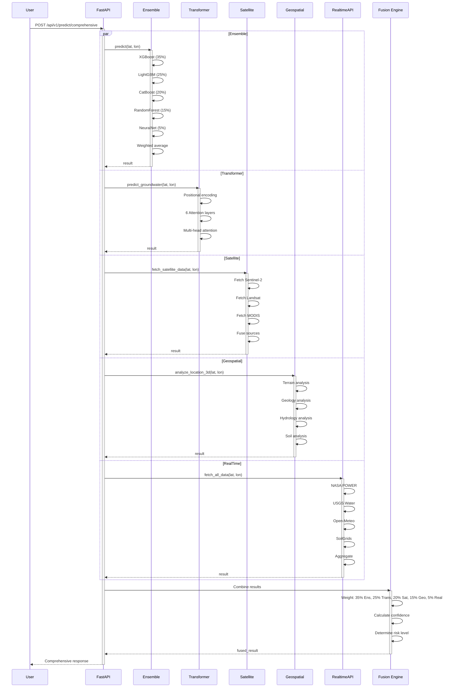

---

## 3. USE CASE DIAGRAM

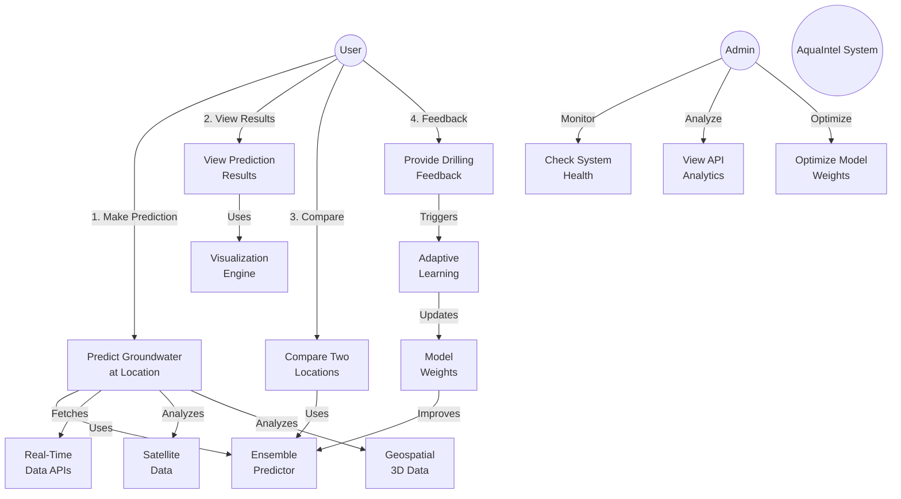

---

## 4. COMPONENT DIAGRAM

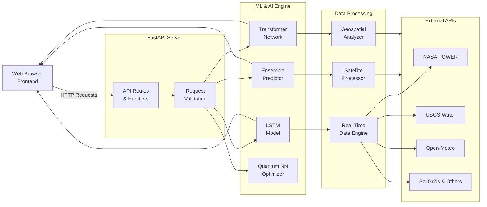

---

## 5. DEPLOYMENT DIAGRAM

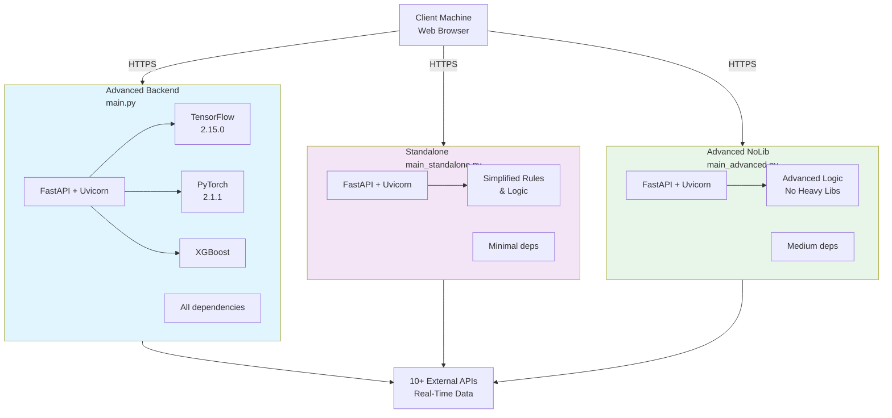

---

## 6. STATE DIAGRAM - Prediction Lifecycle

```mermaid
stateDiagram-v2
    [*] --> Idle
    
    Idle -->|User Input| Validating: latitude, longitude\nanalysis_depth
    
    Validating -->|Valid| Fetching: Request received
    Validating -->|Invalid| Error: Invalid input
    Error --> [*]
    
    Fetching -->|Parallel| Ensemble_Run
    Fetching -->|Parallel| Transformer_Run
    Fetching -->|Parallel| Satellite_Run
    Fetching -->|Parallel| Geospatial_Run
    Fetching -->|Parallel| RealTime_Run
    
    Ensemble_Run -->|Complete| Waiting
    Transformer_Run -->|Complete| Waiting
    Satellite_Run -->|Complete| Waiting
    Geospatial_Run -->|Complete| Waiting
    RealTime_Run -->|Complete| Waiting
    
    Waiting -->|All Complete| Fusion
    
    Fusion -->|Combine Results| Scoring
    Scoring -->|Calculate Confidence| Optimization
    Optimization -->|Quantum Annealing| ResponseGen
    
    ResponseGen -->|Generate JSON| Success
    Success --> [*]
    
    note right of Validating
        Validate request
        Check bounds
        Authenticate
    end note
    
    note right of Ensemble_Run
        XGBoost
        LightGBM
        CatBoost
        RF, NN
    end note
    
    note right of Fusion
        Weight: 35% Ens
        25% Trans
        20% Sat
        15% Geo
        5% Real
    end note
```

---

## 7. ACTIVITY DIAGRAM - Comprehensive Prediction

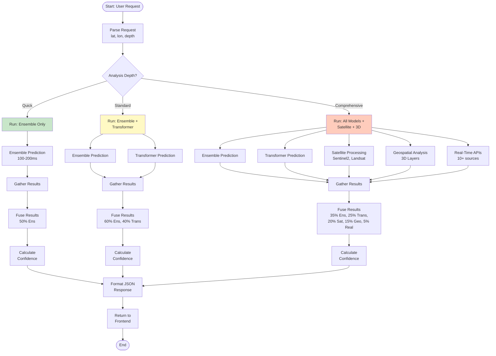

---

## 8. PACKAGE DIAGRAM

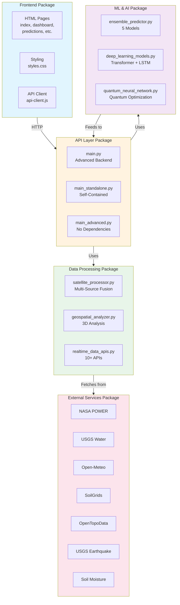

---

## 9. TIMING DIAGRAM - Response Times

```
Prediction Type      | Ensemble | Transformer | Satellite | Geospatial | Real-Time | Fusion | Total
---------------------|----------|-------------|-----------|------------|-----------|--------|--------
Quick (Ensemble)     | 100-200ms|             |           |            |           | 10ms   | ~220ms
Standard (E+T)       | 100-200ms| 150-300ms  |           |            |           | 15ms   | ~500ms
Comprehensive        | 100-200ms| 150-300ms  | 3-5s      | 2-4s       | 2-3s      | 50ms   | ~5-15s
```

---

## 10. DATA FLOW DIAGRAM - Real-Time Integration

```mermaid
graph LR
    User[User Request]
    
    User -->|lat, lon| Engine["RealtimeDataEngine<br/>fetch_all_data()"]
    
    Engine -->|Async Task 1| NASA["NASA POWER<br/>365-day history<br/>Climate data"]
    Engine -->|Async Task 2| USGS["USGS Water<br/>Groundwater wells<br/>Water levels"]
    Engine -->|Async Task 3| OM["Open-Meteo<br/>Current weather<br/>5-year archive"]
    Engine -->|Async Task 4| SG["SoilGrids<br/>Soil props 3 depths<br/>Clay, sand, silt"]
    Engine -->|Async Task 5| OT["OpenTopoData<br/>Elevation<br/>SRTM 90m"]
    Engine -->|Async Task 6| EQ["USGS Earthquake<br/>5-year seismic<br/>Magnitude data"]
    Engine -->|Async Task 7| SM["Soil Moisture<br/>Surface + deep<br/>30-day history"]
    Engine -->|Async Task 8| PRECIP["Precipitation<br/>90-day history<br/>7-day forecast"]
    
    NASA -->|asyncio.gather()| Aggregate["Aggregate Results<br/>10+ data sources"]
    USGS -->|asyncio.gather()| Aggregate
    OM -->|asyncio.gather()| Aggregate
    SG -->|asyncio.gather()| Aggregate
    OT -->|asyncio.gather()| Aggregate
    EQ -->|asyncio.gather()| Aggregate
    SM -->|asyncio.gather()| Aggregate
    PRECIP -->|asyncio.gather()| Aggregate
    
    Aggregate --> Scoring["Calculate<br/>Groundwater<br/>Score"]
    
    Scoring -->|30% Weight| Precip_Score["Precipitation<br/>Score"]
    Scoring -->|20% Weight| Climate_Score["Climate<br/>History Score"]
    Scoring -->|15% Weight| Soil_Score["Soil<br/>Composition"]
    Scoring -->|15% Weight| Moisture_Score["Soil Moisture<br/>Score"]
    Scoring -->|10% Weight| Elev_Score["Elevation<br/>Score"]
    Scoring -->|10% Weight| Wells_Score["USGS Wells<br/>Proximity"]
    
    Precip_Score --> Final["Final Groundwater<br/>Potential Score<br/>0-100"]
    Climate_Score --> Final
    Soil_Score --> Final
    Moisture_Score --> Final
    Elev_Score --> Final
    Wells_Score --> Final
    
    Final --> Output["Return to<br/>Prediction Engine"]
```

---

## 11. OBJECT DIAGRAM - Example Instance

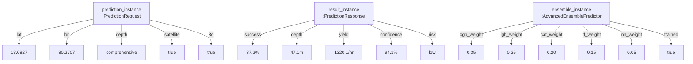

---

## 12. COMMUNICATION DIAGRAM

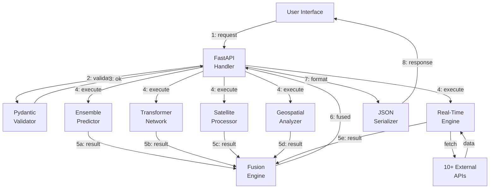

---

## 13. COLLABORATION DIAGRAM

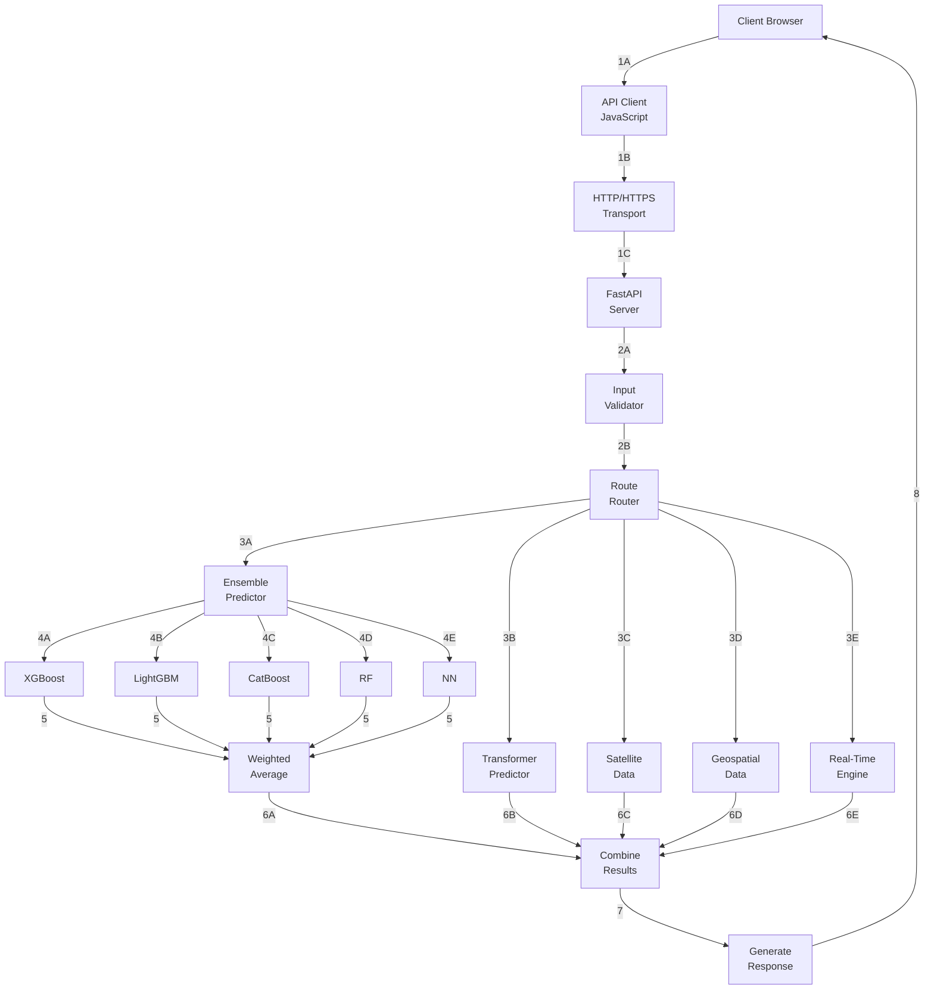

---

## Key Statistics for Your UML Diagrams

- **Total Classes**: 7 main + 20+ supporting
- **Total Methods**: 100+ across all classes
- **Total Attributes**: 50+ data members
- **Relationships**: 40+ (inheritance, composition, aggregation, dependency)
- **External Integrations**: 10+ APIs
- **Data Flow Paths**: 5+ main streams
- **Parallel Process Streams**: 5 (Ensemble, Transformer, Satellite, Geospatial, Real-Time)
- **Asynchronous Operations**: 10+ async methods
- **Total API Endpoints**: 10+
- **Response Time Range**: 100ms - 15 seconds

---

## Tools Recommended for Creating UML Diagrams

1. **Lucidchart** - Complete UML suite
2. **Draw.io** - Free, web-based
3. **Visual Paradigm** - Professional UML
4. **Star UML** - Lightweight, specialized
5. **PlantUML** - Text-based, scriptable
6. **ArchiMate** - Enterprise architecture
7. **Miro** - Collaborative diagramming

---

**All diagrams can be imported into your preferred UML tool!**

